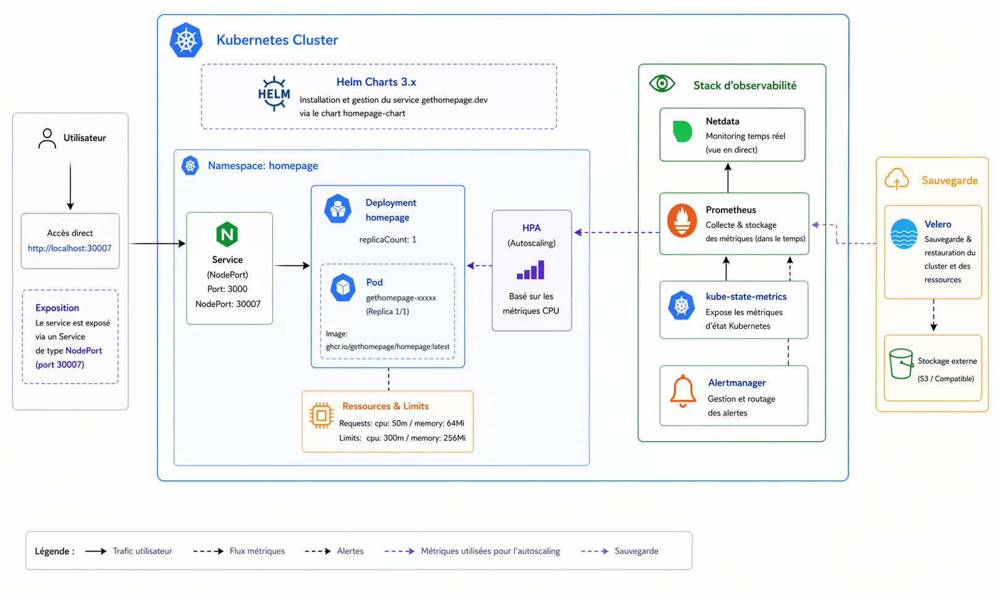

# Déploiement de Homepage

Ce projet permet de déployer [`gethomepage.dev`](https://gethomepage.dev/) sur Kubernetes avec deux approches :

- `k8s/` : manifests Kubernetes classiques, méthode par défaut
- `homepage-chart/` : chart Helm, méthode optimisée

## Prérequis

Avant de commencer, il faut disposer de :

- `kubectl` configuré sur un cluster Kubernetes accessible
- `helm` installé pour la méthode Helm

Commandes de vérification :

```bash
kubectl config current-context
kubectl get nodes
helm version
```

Ces commandes permettent de vérifier que l'on est connecté au bon cluster Kubernetes et que Helm est bien disponible sur la machine.

## 1. Installer Homepage avec les deux méthodes

### Méthode 1 : installation avec les manifests `k8s/`

Cette méthode applique directement les fichiers YAML présents dans le dossier `k8s/`.

Depuis la racine du projet :

```bash
kubectl apply -f k8s/
```

Cette commande crée l'ensemble des ressources Kubernetes décrites dans le dossier `k8s/`, comme le `Deployment`, le `Service`, le `ServiceAccount`, les droits RBAC et les `ConfigMap`.

Vérifier que le service est bien déployé :

```bash
kubectl get pods
kubectl get svc
kubectl get configmaps
kubectl rollout status deployment/homepage
```

Rôle de ces commandes :

- `kubectl get pods` affiche les pods créés pour vérifier qu'ils sont bien démarrés
- `kubectl get svc` affiche les services du cluster, notamment le service `homepage`
- `kubectl get configmaps` permet de confirmer que les fichiers de configuration ont bien été chargés dans Kubernetes
- `kubectl rollout status deployment/homepage` suit l'avancement du déploiement et confirme qu'il s'est terminé correctement

Le service est exposé en `NodePort` sur le port `30007` :

```text
http://localhost:30007
```

Commandes utiles de supervision :

```bash
kubectl logs deployment/homepage
kubectl describe deployment homepage
kubectl describe pod <nom-du-pod>
```

Rôle de ces commandes :

- `kubectl logs deployment/homepage` affiche les journaux de l'application pour repérer une erreur de démarrage ou de configuration
- `kubectl describe deployment homepage` donne le détail du déploiement, de sa stratégie, de ses événements et de son état courant
- `kubectl describe pod <nom-du-pod>` permet d'inspecter un pod précis, utile pour comprendre pourquoi il ne démarre pas ou redémarre en boucle

Supprimer le déploiement :

```bash
kubectl delete -f k8s/
```

Cette commande supprime toutes les ressources créées à partir des manifests du dossier `k8s/`.

### Méthode 2 : installation avec Helm (`homepage-chart/`)

Cette méthode utilise le chart Helm du projet pour générer et installer les ressources Kubernetes.

Depuis la racine du projet :

```bash
helm install homepage ./homepage-chart
```

Cette commande installe une release Helm nommée `homepage` à partir du chart local contenu dans `homepage-chart/`.

Vérifier le déploiement :

```bash
helm list
helm status homepage
kubectl get pods
kubectl get svc
kubectl rollout status deployment/homepage
```

Rôle de ces commandes :

- `helm list` affiche les releases Helm présentes dans le cluster
- `helm status homepage` donne l'état détaillé de la release `homepage`
- `kubectl get pods` vérifie que les pods créés par Helm sont bien en cours d'exécution
- `kubectl get svc` confirme que le service réseau est bien exposé
- `kubectl rollout status deployment/homepage` permet de suivre le bon déroulement du déploiement côté Kubernetes

Comme pour la méthode précédente, le service est exposé par défaut en `NodePort` sur `30007` :

```text
http://localhost:30007
```

Commandes utiles de supervision et de maintenance :

```bash
helm get values homepage
helm history homepage
kubectl logs deployment/homepage
```

Rôle de ces commandes :

- `helm get values homepage` affiche les valeurs utilisées par la release, ce qui permet de vérifier la configuration réellement appliquée
- `helm history homepage` liste les différentes révisions de la release, utile pour suivre les mises à jour et préparer un éventuel retour arrière
- `kubectl logs deployment/homepage` affiche les journaux du conteneur, comme dans la méthode `k8s/`

Si le chart ou `values.yaml` est modifié, mettre à jour la release :

```bash
helm upgrade homepage ./homepage-chart
```

Cette commande applique les modifications du chart sans devoir supprimer puis recréer manuellement toutes les ressources.

Supprimer le déploiement :

```bash
helm uninstall homepage
```

Cette commande supprime la release Helm et les ressources Kubernetes associées.

## 2. Auto-scaling horizontal (HPA)

Le projet inclut un `HorizontalPodAutoscaler` qui ajuste automatiquement le nombre de pods en fonction de la charge CPU. Le nombre de replicas varie entre **1** (minimum) et **3** (maximum), avec un seuil de déclenchement à **70% d'utilisation CPU**.

### Prérequis : Metrics Server

Le HPA nécessite que le **Metrics Server** soit installé dans le cluster. Sans lui, le HPA ne peut pas lire les métriques et reste inactif.

Vérifier s'il est présent :

```bash
kubectl get deployment metrics-server -n kube-system
```

Si la colonne `READY` affiche `0/1`, le Metrics Server est installé mais non fonctionnel. Sur les clusters locaux (kind, k3s, Minikube), il faut désactiver la vérification TLS :

```bash
# Télécharger le manifest officiel et ajouter --kubelet-insecure-tls
Invoke-WebRequest "https://github.com/kubernetes-sigs/metrics-server/releases/latest/download/components.yaml" -OutFile "$env:TEMP\metrics-server.yaml"
$content = Get-Content "$env:TEMP\metrics-server.yaml" -Raw
$content = $content -replace "- --metric-resolution=15s", "- --metric-resolution=15s`r`n        - --kubelet-insecure-tls"
$content | Out-File "$env:TEMP\metrics-server-fixed.yaml" -Encoding utf8
kubectl apply -f "$env:TEMP\metrics-server-fixed.yaml"
```

Vérifier que le Metrics Server est opérationnel :

```bash
kubectl top nodes
```

### Déploiement du HPA

**Avec Helm** (recommandé) — le HPA est activé par défaut dans `homepage-chart/values.yaml` :

```bash
helm install homepage ./homepage-chart
# ou, si la release existe déjà :
helm upgrade homepage ./homepage-chart
```

**Avec les manifests `k8s/`** :

```bash
kubectl apply -f k8s/hpa.yaml
```

### Vérification

```bash
kubectl get hpa homepage
kubectl describe hpa homepage
```

La colonne `TARGETS` doit afficher une valeur réelle, par exemple `4%/70%`. Si elle affiche `<unknown>/70%`, attendre 1 à 2 minutes le temps que les métriques se stabilisent après le démarrage des pods.

### Configuration

Les paramètres du HPA sont centralisés dans `homepage-chart/values.yaml` :

```yaml
autoscaling:
  enabled: true
  minReplicas: 1
  maxReplicas: 3
  targetCPUUtilizationPercentage: 70
  behavior:
    scaleUp:
      stabilizationWindowSeconds: 0      # scale up immédiat
      policies:
        - type: Percent
          value: 100
          periodSeconds: 60
    scaleDown:
      stabilizationWindowSeconds: 300    # attendre 5 min avant de réduire
      policies:
        - type: Percent
          value: 50
          periodSeconds: 60
```

La fenêtre de stabilisation de 300 secondes en scale down évite les oscillations : le HPA attend 5 minutes de charge faible avant de supprimer des pods.

## 3. Analyse comparative : `k8s/` vs Helm

L'approche `k8s/` est la plus simple à comprendre : on applique directement des manifests statiques avec `kubectl apply -f k8s/`. Elle convient bien pour un premier déploiement, pour apprendre Kubernetes, ou pour voir explicitement toutes les ressources créées. En revanche, elle devient vite plus lourde à maintenir dès qu'il faut faire évoluer la configuration, dupliquer le déploiement dans plusieurs environnements, ou rejouer proprement des mises à jour.

L'approche Helm apporte une couche d'abstraction utile : les manifests sont générés à partir de templates et de variables centralisées dans `homepage-chart/values.yaml`. Cela rend le déploiement plus réutilisable, plus configurable et plus propre à faire évoluer. Helm facilite aussi l'exploitation grâce à des commandes natives comme `helm upgrade`, `helm history`, `helm rollback` ou `helm uninstall`.

En pratique, le passage de `k8s/` à Helm apporte surtout trois bénéfices :

- une configuration centralisée et plus facile à personnaliser
- des mises à jour plus propres avec versionnement des releases
- une meilleure maintenabilité si le service doit évoluer ou être redéployé plusieurs fois

En résumé, la méthode `homepage-chart/` est préférable pour un déploiement plus industrialisé et plus simple à administrer dans le temps.

## 4. Schéma de l'infrastructure Kubernetes : 

